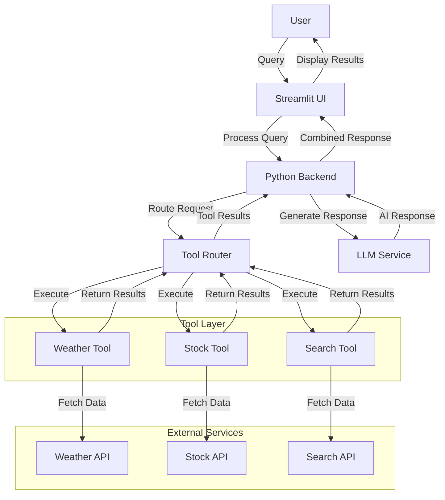

# Building the ToolConnect Sample Application for LangIQ: Integrating AI with External APIs

## 1. Problem Statement

### Challenge

The modern data landscape is characterized by an abundance of disparate systems and external data sources. However, the integration of these systems with language models remains a challenge. Users often require multi-faceted interactions with external APIs, databases, and search engines while leveraging AI for enhanced outputs.

### Importance

This capability is crucial as it allows applications to provide real-time, context-aware, and relevant information. The interaction between language models and external data enriches user experience, enabling advanced applications like smart assistants, intelligent search, and decision support tools.

### Solution Demonstration

The ToolConnect application serves as a practical demonstration of LangIQ's expertise in integrating AI with external APIs, showcasing our ability to build user-friendly interfaces that facilitate seamless communication between diverse data sources and AI models.

## 2. Requirements

### Functional Requirements

- Connect to multiple external APIs.
- Allow users to input queries to the language model.
- Display responses fetched from APIs in conjunction with the AI model's output.
- Store user interaction history for improved response relevance.
- Enable a conversational experience with context retention.

### Technical Requirements

- **Libraries**:
  - `streamlit`: For building the web interface.
  - `openai`: For interacting with OpenAI's language models.
  - `requests`: To make API calls.
  - `pandas`: For data manipulation.
  - `python-dotenv`: For environment variable management.
  - `pydantic`: For data validation and settings management.
- **APIs**: OpenAI for LLM interactions; custom APIs for external data sources.
- **Models**: GPT-4 or similar advanced language model.

### Constraints and Limitations

- Rate limits imposed by third-party APIs.
- API response time and dependency on external service availability.
- Potential costs associated with API usage and OpenAI model access.
- Security considerations for API keys and sensitive data.

## 3. Solution Design

### High-Level Architecture

The application features a tiered architecture comprising:

- **Frontend**: Streamlit for user interaction.
- **Backend**: Python services for API integration, data handling, and LLM processing.
- **Data Layer**: Local storage or a database to manage user queries and conversation history.
- **Tool Layer**: Modular components that integrate with various external APIs.

#### Architecture Diagram



### Key Components Interaction

1. **User Interface (Streamlit)**: Accepts user queries and displays responses.
2. **Backend (Python)**:
   - Processes user input.
   - Fetches relevant data from external APIs.
   - Combines API results with LLM output.
   - Maintains conversation context.
3. **Tool Router**: Determines which external API to call based on query content.
4. **Response Output**: Displays results in real-time to users.

### Data Flow

1. User inputs a query via the Streamlit interface.
2. The backend Python service analyzes the query and selects appropriate tools.
3. The backend fetches data from relevant APIs through the tool layer.
4. Results are combined with LLM responses using structured formatting.
5. Output is rendered back in the UI with appropriate visualizations.
6. Conversation history is updated for context retention.

### Design Decisions

- Leveraging Streamlit's simplicity enhances rapid UI development.
- A modular backend allows for easy modifications and integrations with various APIs.
- Tool-based approach enables easy addition of new data sources without major refactoring.
- Type hints and Pydantic models ensure data integrity throughout the application.

## 4. Implementation

### Step-by-Step Process

Below is a comprehensive implementation of the ToolConnect application.

#### 1. Project Structure

```
tool-connect/
├── app.py                 # Main Streamlit application
├── config.py              # Configuration management
├── requirements.txt       # Project dependencies
├── .env                   # Environment variables (not in version control)
├── utils/
│   ├── __init__.py
│   └── helpers.py         # Utility functions
├── tools/
│   ├── __init__.py
│   ├── base.py            # Base class for tools
│   ├── weather.py         # Weather API integration
│   ├── stocks.py          # Stock market data integration
│   └── search.py          # Web search integration
└── services/
    ├── __init__.py
    ├── llm_service.py     # LLM integration service
    └── tool_router.py     # Tool routing service
```

#### 2. Configuration Management

```python
# config.py
import os
from pydantic import BaseSettings, Field
from dotenv import load_dotenv

load_dotenv()  # Load environment variables from .env file

class Settings(BaseSettings):
    openai_api_key: str = Field(..., env="OPENAI_API_KEY")
    weather_api_key: str = Field(..., env="WEATHER_API_KEY")
    stocks_api_key: str = Field(..., env="STOCKS_API_KEY")
    search_api_key: str = Field(..., env="SEARCH_API_KEY")

    model_name: str = "gpt-4"
    temperature: float = 0.7
    max_tokens: int = 500

settings = Settings()
```

        """Execute the tool with the given query."""
        pass

    @property
    def tool_info(self) -> Dict[str, str]:
        """Return information about the tool for LLM."""
        return {
            "name": self.name,
            "description": self.description tools."""
        }

````

#### 4. Weather Tool Example
```python
# tools/weather.py
import aiohttp
from typing import Dict, Any, Optional
from .base import BaseTool
from config import settings

class WeatherTool(BaseTool):esponse.status == 200:
    """Tool for fetching weather data."""on()
    her_data(data)
    name = "weather"
    description = "Get current weather and forecast for a location"PI returned status {response.status}"}

    async def execute(self, query: str, **kwargs) -> Dict[str, Any]:  return {"error": f"Failed to fetch weather data: {str(e)}"}
        """Fetch weather data for the location in the query."""
        location = query.strip()eather_data(self, data: Dict[str, Any]) -> Dict[str, Any]:
        nto a structured format."""
        async with aiohttp.ClientSession() as session:
            url = f"https://api.weatherapi.com/v1/forecast.json"
            params = {
                "key": settings.weather_api_key,
                "q": location,}",
                "days": 3current": {
            }       "temp_c": current.get("temp_c"),
                         "temp_f": current.get("temp_f"),
            try:                "condition": current.get("condition", {}).get("text"),
                async with session.get(url, params=params) as response:midity": current.get("humidity"),
                    if response.status == 200:       "wind_kph": current.get("wind_kph")
                        data = await response.json()
                        return self._format_weather_data(data)
                    else:   {
                        return {"error": f"Weather API returned status {response.status}"} day.get("date"),
            except Exception as e:                    "max_temp_c": day.get("day", {}).get("maxtemp_c"),
                return {"error": f"Failed to fetch weather data: {str(e)}"}t("day", {}).get("mintemp_c"),
    def _format_weather_data(self, data: Dict[str, Any]) -> Dict[str, Any]:       "condition": day.get("day", {}).get("condition", {}).get("text")
        """Format the weather API response into a structured format."""
        current = data.get("current", {})            for day in data.get("forecast", {}).get("forecastday", [])
        location = data.get("location", {})

        return {
            "location": f"{location.get('name')}, {location.get('country')}",
            "current": {ervice
                "temp_c": current.get("temp_c"),
                "temp_f": current.get("temp_f"),n
                "condition": current.get("condition", {}).get("text"),
                "humidity": current.get("humidity"),ict, Any, Optional
                "wind_kph": current.get("wind_kph")
            },
            "forecast": [
                {pi_key = settings.openai_api_key
                    "date": day.get("date"),
                    "max_temp_c": day.get("day", {}).get("maxtemp_c"),
                    "min_temp_c": day.get("day", {}).get("mintemp_c"),s."""
                    "condition": day.get("day", {}).get("condition", {}).get("text")
                }ticmethod
                for day in data.get("forecast", {}).get("forecastday", [])
            ]
        }tools_data: Optional[Dict[str, Any]] = None
```:

#### 5. LLM Service
```pythonools data if available
# services/llm_service.py
from typing import List, Dict, Any, Optional
import openaicontent": "You are a helpful assistant that can use tools to answer questions."
from config import settings

openai.api_key = settings.openai_api_key
         system_message["content"] += " You have the following tools available:\n"
class LLMService:            for tool_name, tool_data in tools_data.items():
    """Service for interacting with OpenAI's language models."""tem_message["content"] += f"\n- {tool_name}: {tool_data}"

    @staticmethodage at the beginning
    async def get_response(l_messages = [system_message] + messages
        messages: List[Dict[str, str]],
        tools_data: Optional[Dict[str, Any]] = None
    ) -> str:t openai.ChatCompletion.acreate(
        """Get response from the language model."""model_name,
                        messages=full_messages,
        # Prepare system message with tools data if availableemperature=settings.temperature,
        system_message = {
            "role": "system",        )
            "content": "You are a helpful assistant that can use tools to answer questions.".content
        }
        "
        if tools_data:
            system_message["content"] += " You have the following tools available:\n"
            for tool_name, tool_data in tools_data.items():
                system_message["content"] += f"\n- {tool_name}: {tool_data}"

        # Add system message at the beginningol_router.py
        full_messages = [system_message] + messages
         List, Optional
        try:
            response = await openai.ChatCompletion.acreate(
                model=settings.model_name,
                messages=full_messages,
                temperature=settings.temperature,
                max_tokens=settings.max_tokensappropriate tools."""
            )
            return response.choices[0].message.content
        except Exception as e:ailable tools."""
            return f"Error generating response: {str(e)}".name: tool for tool in tools}
```
uery(self, query: str) -> Dict[str, Any]:
#### 6. Tool Routerine which tools to use and execute them."""
```pythonmat tools for OpenAI function calling
# services/tool_router.py
import json   {
from typing import Dict, Any, List, Optional        "type": "function",
import openai    "function": {
from config import settings
from tools.base import BaseTool

class ToolRouter:ype": "object",
    """Service for routing queries to appropriate tools."""   "properties": {

    def __init__(self, tools: List[BaseTool]):
        """Initialize with available tools."""          "description": "The query to process with this tool"
        self.tools = {tool.name: tool for tool in tools}
              },
    async def route_query(self, query: str) -> Dict[str, Any]:uired": ["query"]
        """Determine which tools to use and execute them."""
        # Format tools for OpenAI function calling   }
        tools = [}
            {
                "type": "function",
                "function": {
                    "name": tool.name,
                    "description": tool.description,
                    "parameters": {create(
                        "type": "object",
                        "properties": {
                            "query": {
                                "type": "string",
                                "description": "The query to process with this tool""content": "You determine which tools to use based on user queries."
                            }
                        },
                        "required": ["query"]
                    }    tools=tools,
                }ce="auto"
            }
            for tool in self.tools.values()
        ]         result = {"query": query, "tool_outputs": {}}

        try:
            # Ask the model which tools to use   message = response.choices[0].message
            response = await openai.ChatCompletion.acreate(    if hasattr(message, "tool_calls") and message.tool_calls:
                model=settings.model_name,ol_call in message.tool_calls:
                messages=[      tool_name = tool_call.function.name
                    {         if tool_name in self.tools:
                        "role": "system", s = json.loads(tool_call.function.arguments)
                        "content": "You determine which tools to use based on user queries."et("query", query)
                    },
                    {"role": "user", "content": query} tool
                ], = await self.tools[tool_name].execute(tool_query)
                tools=tools,l_outputs"][tool_name] = tool_result
                tool_choice="auto"
            )

            result = {"query": query, "tool_outputs": {}}, "error": str(e)}
            ```
            # Process tool calls
            message = response.choices[0].messageUI with Chat History
            if hasattr(message, "tool_calls") and message.tool_calls:
                for tool_call in message.tool_calls:
                    tool_name = tool_call.function.name
                    if tool_name in self.tools:t
                        args = json.loads(tool_call.function.arguments)
                        tool_query = args.get("query", query)t json

                        # Execute the toolort LLMService
                        tool_result = await self.tools[tool_name].execute(tool_query)from services.tool_router import ToolRouter
                        result["tool_outputs"][tool_name] = tool_result
            from tools.stocks import StocksTool
            return resultls.search import SearchTool
        except Exception as e:
            return {"query": query, "error": str(e)}
```if "messages" not in st.session_state:
essages = []
#### 7. Streamlit UI with Chat History
```python
# app.py
import streamlit as st
import asyncio
import json
from config import settings
from services.llm_service import LLMService
from services.tool_router import ToolRouter
from tools.weather import WeatherTool
from tools.stocks import StocksTool    return tools, tool_router
from tools.search import SearchTool
()
# Initialize session state for chat history
if "messages" not in st.session_state:
    st.session_state.messages = []Application")
tion, or web search results.")
# Initialize tools and services
@st.cache_resource
def load_tools_and_services():essages:
    tools = [sage["role"]):
        WeatherTool(),    if message["role"] == "user":
        StocksTool(),ntent"])
        SearchTool()
    ]essage["tool_data"]:
    tool_router = ToolRouter(tools)
    return tools, tool_router        with st.expander("Tool Data"):

tools, tool_router = load_tools_and_services()])

# App UI
st.title("ToolConnect: AI Integration Application")
st.write("Ask questions that might require weather data, stock market information, or web search results.")

# Display chat history
for message in st.session_state.messages:on_state.messages.append({"role": "user", "content": user_query})
    with st.chat_message(message["role"]):
        if message["role"] == "user":
            st.write(message["content"])
        else:
            if "tool_data" in message and message["tool_data"]:
                # Display tool data in a collapsible sectiony assistant thinking
                with st.expander("Tool Data"):
                    st.json(message["tool_data"])processing_placeholder = st.empty()
            st.write(message["content"])ing your request...")

# Chat input# Process with tools and get LLM response
user_query = st.chat_input("Ask something:")

if user_query:ait tool_router.route_query(user_query)
    # Add user message to chat history    tool_outputs = router_result.get("tool_outputs", {})
    st.session_state.messages.append({"role": "user", "content": user_query})

    # Display user messager", "content": user_query}]
    with st.chat_message("user"):
        st.write(user_query)
    e.get_response(
    # Display assistant thinking,
    with st.chat_message("assistant"):uts
        processing_placeholder = st.empty()
        processing_placeholder.text("Processing your request...")
                 return llm_response, tool_outputs
        # Process with tools and get LLM response
        async def get_full_response():nction and get results
            # Get tool outputso.run(get_full_response())
            router_result = await tool_router.route_query(user_query)
            tool_outputs = router_result.get("tool_outputs", {})

            # Format messages for LLM
            messages = [{"role": "user", "content": user_query}]

            # Get LLM response with tool data            with st.expander("Tool Data"):
            llm_response = await LLMService.get_response((tool_outputs)
                messages=messages,
                tools_data=tool_outputst response to chat history
            )ages.append({
              "role": "assistant",
            return llm_response, tool_outputs
        data": tool_outputs
        # Run async function and get results  })
        llm_response, tool_outputs = asyncio.run(get_full_response())```

        # Update placeholder with actual responsetive Aspects
        processing_placeholder.empty()
        st.write(llm_response)

        if tool_outputs:1. **Tool-based Architecture**: Modular design allows easy addition of new capabilities.
            with st.expander("Tool Data"):: LLM automatically determines which tools are needed based on user queries.
                st.json(tool_outputs)ion history with collapsible tool data provides transparency.
        essing**: Non-blocking API calls improve user experience with faster responses.
        # Add assistant response to chat historyPydantic models and type hints ensure data integrity.
        st.session_state.messages.append({
            "role": "assistant", etup
            "content": llm_response,
            "tool_data": tool_outputs
        })
```pository**:

### Innovative Aspects   ```bash
The innovation lies in several key aspects: https://github.com/langiq/tool-connect.git
-connect
1. **Tool-based Architecture**: Modular design allows easy addition of new capabilities.
2. **Dynamic Tool Selection**: LLM automatically determines which tools are needed based on user queries.
3. **Rich UI Experience**: Conversation history with collapsible tool data provides transparency.2. **Create a Virtual Environment**:
4. **Async Processing**: Non-blocking API calls improve user experience with faster responses.
5. **Type Safety**: Pydantic models and type hints ensure data integrity.
nv env
## 5. Environment Setupows use `env\Scripts\activate`

### Setup Instructions
1. **Clone the Repository**:
   ```bashate a `requirements.txt` file:
   git clone https://github.com/langiq/tool-connect.git
   cd tool-connect
   ```   streamlit>=1.28.0

2. **Create a Virtual Environment**:   requests>=2.31.0
   ```bash
   python -m venv env
   source env/bin/activate  # On Windows use `env\Scripts\activate`
   ```

3. **Install Requirements**:
   Create a `requirements.txt` file:   Then run:
   ```plaintext
   streamlit>=1.28.0
   openai>=1.3.0stall -r requirements.txt
   requests>=2.31.0
   pandas>=2.0.0
   python-dotenv>=1.0.0
   pydantic>=2.4.0he following structure:
   aiohttp>=3.8.5```plaintext
   ```   OPENAI_API_KEY=your_openai_api_key
your_weather_api_key
   Then run:
   ```bash_API_KEY=your_search_api_key
   pip install -r requirements.txt``
   ```

4. **Configure API Keys**:
   Create a `.env` file with the following structure: Important Parts of the Codebase
   ```plaintext
   OPENAI_API_KEY=your_openai_api_keyn Pattern
   WEATHER_API_KEY=your_weather_api_key
   STOCKS_API_KEY=your_stocks_api_keyEach tool follows a consistent pattern:
   SEARCH_API_KEY=your_search_api_key
   ```
2. Define name and description for tool discovery
## 6. Code Walkthrough method for API interaction

### Important Parts of the Codebase

#### Tool Implementation Pattern
Each tool follows a consistent pattern:The application uses `async/await` for non-blocking API calls:
1. Inherit from `BaseTool` abstract class
2. Define name and description for tool discovery```python
3. Implement `execute()` method for API interactione(self, query: str, **kwargs) -> Dict[str, Any]:
4. Process and format the response for consumption by LLM
        async with session.get(url, params=params) as response:
#### Async Processing   # process response
The application uses `async/await` for non-blocking API calls:
```python
async def execute(self, query: str, **kwargs) -> Dict[str, Any]:dling
    async with aiohttp.ClientSession() as session:
        async with session.get(url, params=params) as response:Robust error handling ensures the application gracefully manages failures:
            # process response
```

#### Error Handlingsing logic
Robust error handling ensures the application gracefully manages failures:
```pythonreturn {"error": f"Operation failed: {str(e)}"}
try:
    # API call or processing logic
except Exception as e: Tool Routing Logic
    return {"error": f"Operation failed: {str(e)}"}
```ates how to leverage LLM capabilities to determine which tools to use for a given query.

#### Tool Routing Logic
The `ToolRouter` class demonstrates how to leverage LLM capabilities to determine which tools to use for a given query.
Each module (UI, API, LLM) has a clear responsibility, fostering easier maintenance and enhancing modular design.
### Module Interactions
Each module (UI, API, LLM) has a clear responsibility, fostering easier maintenance and enhancing modular design.

### Troubleshooting TipsPI keys and ensure they're set correctly in the environment.
- Check API keys and ensure they're set correctly in the environment.id disruptions in service.
- Monitor API limits to avoid disruptions in service.ailed error messages in the tool responses to diagnose integration issues.
- Use the detailed error messages in the tool responses to diagnose integration issues.rk connectivity for external API calls.
- Verify network connectivity for external API calls.

## 7. Testing and Quality Assurance
### Unit Testing
### Comprehensive Test Strategy
d services:
For a production-ready application, implement this comprehensive testing strategy:

1. **Unit Tests**: Test each component in isolation
   - Tool implementations
   - LLM service functionalityrt asyncio
   - Router logics.weather import WeatherTool
   - Configuration management
est.mark.asyncio
2. **Integration Tests**: Test interactions between componentsst_weather_tool():
   - Tool routing with LLM
   - API service connections
   - Data flow between modules query = "San Francisco"

3. **End-to-End Tests**: Test the complete user flow
   - Full query-response cycle testse(query)
   - UI interaction tests using Streamlit testing utilities

4. **Property-Based Testing**: Test with random inputs to discover edge cases
   ```python    assert "current" in result
   # Using hypothesis for property-based testinglt
   from hypothesis import given, strategies as st```

   @given(query=st.text(min_size=1, max_size=200))
   def test_tool_router_with_random_queries(query):
       # Run the tool router with random queriesntegration between different components:
       result = asyncio.run(router.route_query(query))
       assert isinstance(result, dict)hon
       assert "query" in result# tests/test_integration.py
       # No exceptions should be raised
   ```
rvices.tool_router import ToolRouter
5. **Security Tests**: Test for common vulnerabilitiesweather import WeatherTool
   - Input validation
   - API key handling
   - Dependency scanningio
ter_integration():
6. **Load Testing**: Test system performance under load
   ```pythonTool(), StocksTool()]
   # Simple load test example router = ToolRouter(tools)
   import asyncio the weather in New York and how are Apple stocks doing?"
   import time

   async def load_test(router, queries, concurrency=10): result = await router.route_query(query)
       start_time = time.time()
       tasks = []
           assert "tool_outputs" in result
       for i in range(0, len(queries), concurrency):l_outputs"]) > 0
           batch = queries[i:i+concurrency]
           batch_tasks = [router.route_query(q) for q in batch]
           results = await asyncio.gather(*batch_tasks)
           tasks.extend(results)

       end_time = time.time()
       duration = end_time - start_time

       return {
           "total_queries": len(queries),
           "duration_seconds": duration,
           "queries_per_second": len(queries) / duration
       }
   ```

## 8. Running the Application

### Launching the App   streamlit run app.py
1. Ensure you're in the project directory with the virtual environment activated.


By following this tutorial and exploring these real-world applications, you'll be well-equipped to build your own AI-powered tools that integrate with external systems to provide valuable, context-aware responses.- Analyzes personal finance data and provides insights- Provides weather-aware commute recommendations- Searches through email- Manages calendar appointmentsBuild a personal assistant that:### Personal Productivity Assistant- Generates natural language insights from company data- Summarizes news articles relevant to your industry- Analyzes market trends- Fetches real-time financial dataCreate an executive dashboard that:### Business Intelligence Dashboard- Escalate to human agents when necessary- Generate personalized responses based on customer history- Look up customer order status from a database- Access a knowledge base of product informationExtend ToolConnect to create an AI customer support system that can:### Customer Support SystemToolConnect's architecture can be adapted for various real-world applications:## 13. Real-World Applications   ```           raise           print(f"[{trace_id}] {tool.name} failed after {duration:.2f}s: {str(e)}")           duration = time.time() - start_time       except Exception as e:           return result           print(f"[{trace_id}] {tool.name} completed in {duration:.2f}s")           duration = time.time() - start_time           result = await tool.execute(query, **kwargs)       try:       start_time = time.time()              print(f"[{trace_id}] Executing {tool.name} with query: {query[:50]}...")       trace_id = str(uuid.uuid4())   async def traced_tool_execution(tool, query: str, **kwargs):   # Wrap tool execution with tracing   ```python2. **Tool Execution Tracing**:   ```           f.write(json.dumps(log_entry) + "\n")       with open("request_logs.jsonl", "a") as f:       # Write to log file or database       }           "tools_used": tools_used           "query": query,           "timestamp": datetime.now().isoformat(),           "request_id": request_id,       log_entry = {   async def log_request(request_id: str, query: str, tools_used: List[str]):   # Implement detailed request logging   ```python1. **Request Logging**:### Debugging Tools   ```           }               "timestamp": time.time()               "result": result,           self.cache[query] = {       def set(self, query: str, result):                      return None                   return entry["result"]               if time.time() - entry["timestamp"] < self.ttl:               entry = self.cache[query]           if query in self.cache:       def get(self, query: str):                      self.ttl = ttl           self.cache = {}       def __init__(self, ttl=3600):  # Time to live in seconds   class QueryCache:   # Implement caching for common queries   ```python   - **Solution**: Implement timeouts, parallel processing, and caching.   - **Problem**: Application takes too long to respond3. **Slow Responses**:   ```       return "Authentication failed. Check your API key configuration."   except openai.error.AuthenticationError:       return f"Invalid request to language model: {str(e)}"   except openai.error.InvalidRequestError as e:       return "The service is currently experiencing high demand. Please try again later."   except openai.error.RateLimitError:       response = await openai.ChatCompletion.acreate(...)   try:   # Expanded LLM error handling   ```python   - **Solution**: Verify OpenAI API key, check quota limits, and ensure proper request formatting.   - **Problem**: "Error generating response from OpenAI"2. **LLM Response Errors**:   ```       return {"error": "Request timed out. The service might be experiencing high load."}   except asyncio.TimeoutError:       return {"error": f"API responded with error: {e.status}"}   except aiohttp.ClientResponseError as e:       return {"error": "Network connectivity issue. Check your internet connection."}   except aiohttp.ClientConnectorError:       response = await session.get(url, params=params, timeout=10)   try:   # Improved API error handling   ```python   - **Solution**: Verify API keys, check network connectivity, and ensure API endpoints are correct.   - **Problem**: "Failed to fetch data from external API"1. **API Connection Issues**:### Common Issues and Solutions## 12. Troubleshooting FAQ   ```       })           "timestamp": datetime.now().isoformat()           "feedback": user_feedback,           "response": response,           "query": query,       log_interaction({       # This data can be analyzed to improve the system       # Record query, response, and any user feedback   def track_success(query: str, response: str, user_feedback: Optional[bool] = None):   ```python2. **Success Rate Tracking**:   ```       return response.choices[0].message.content.strip()       )           ]               {"role": "user", "content": query}               {"role": "system", "content": "Categorize this query into one of: Weather, Finance, Search, Other"},           messages=[           model="gpt-3.5-turbo",       response = await openai.ChatCompletion.acreate(       # Use LLM to categorize the query   async def categorize_query(query: str) -> str:   ```python1. **Query Categories**:Track user interactions to improve the application:### User Analytics   ```           return self.call_counts       def get_usage_report(self):                      self.call_counts[api_name] += 1               self.call_counts[api_name] = 0           if api_name not in self.call_counts:       def record_call(self, api_name: str):                      self.call_counts = {}       def __init__(self):   class APIMonitor:   ```python2. **API Usage Monitoring**:   ```       return result              })           "args": str(args)[:100]  # Limited for privacy           "function": func.__name__,       log_metric("response_time", duration, {       # Log or store the duration              duration = time.time() - start_time       result = await func(*args, **kwargs)       start_time = time.time()   async def track_response_time(func, *args, **kwargs):   ```python1. **Response Time Tracking**:### Performance MetricsImplement monitoring to track application performance and usage:## 11. Monitoring and Analytics   ```           return True           self.calls.append(current_time)                              return False           if len(self.calls) >= self.max_calls:                                   if call > current_time - self.time_frame]           self.calls = [call for call in self.calls            # Remove old calls           current_time = time.time()       def is_allowed(self) -> bool:                      self.calls = []           self.time_frame = time_frame  # in seconds           self.max_calls = max_calls       def __init__(self, max_calls: int, time_frame: int):   class RateLimiter:   # Simple rate limiting implementation   ```python2. **Rate Limiting**:   ```       return True           return False       if len(query) > 500:  # Set reasonable limits           return False       if not query or len(query.strip()) == 0:   def validate_query(query: str) -> bool:   # Validate user input before processing   ```python1. **Input Validation**:### Request Validation   - Provide users with options to clear their conversation history   - Implement clear data retention policies2. **Data Retention**:   ```       return sanitized       sanitized = re.sub(r'[<>]', '', user_query)       # Remove potentially harmful characters or patterns   def sanitize_input(user_query: str) -> str:   # Sanitize user inputs   ```python1. **User Data**:### Data Protection   - Use service accounts with limited permissions   - Implement policies to rotate API keys regularly2. **Secret Rotation**:   - For production, use secure secret management services   - Use `.env` files for local development only   - Never hardcode API keys in your source code1. **Environment Variables**:### API Key ManagementWhen building AI applications that connect to external services, security is paramount:## 10. Security Considerations   ```       }           })               'tool_outputs': tool_outputs               'response': llm_response,           'body': json.dumps({           'statusCode': 200,       return {              ))           tools_data=tool_outputs           messages=messages,       llm_response = asyncio.run(LLMService.get_response(       messages = [{"role": "user", "content": query}]       # Get LLM response              tool_outputs = router_result.get("tool_outputs", {})       router_result = asyncio.run(tool_router.route_query(query))       # Process the query              query = json.loads(event['body'])['query']   def lambda_handler(event, context):   tool_router = ToolRouter(tools)   tools = [WeatherTool(), StocksTool(), SearchTool()]   # Initialize tools and services   from tools.search import SearchTool   from tools.stocks import StocksTool   from tools.weather import WeatherTool   from services.llm_service import LLMService   from services.tool_router import ToolRouter   import asyncio   import json   # lambda_handler.py   ```python   For AWS Lambda with API Gateway:3. **Serverless Deployment**:   ```     type: LoadBalancer       targetPort: 8501     - port: 80     ports:       app: toolconnect     selector:   spec:     name: toolconnect-service   metadata:   kind: Service   apiVersion: v1   ---               name: toolconnect-secrets           - secretRef:           envFrom:           - containerPort: 8501           ports:           image: toolconnect:latest         - name: toolconnect         containers:       spec:           app: toolconnect         labels:       metadata:     template:         app: toolconnect       matchLabels:     selector:     replicas: 3   spec:     name: toolconnect   metadata:   kind: Deployment   apiVersion: apps/v1   ```yaml   Create a `kubernetes.yaml` file:2. **Kubernetes Deployment**:   ```   docker run -p 8501:8501 -e OPENAI_API_KEY=$OPENAI_API_KEY toolconnect   docker build -t toolconnect .   ```bash   Build and run:   ```   ENTRYPOINT ["streamlit", "run", "app.py", "--server.port=8501", "--server.address=0.0.0.0"]      HEALTHCHECK CMD curl --fail http://localhost:8501/_stcore/health || exit 1      EXPOSE 8501      COPY . .      RUN pip install --no-cache-dir -r requirements.txt   COPY requirements.txt .      WORKDIR /app      FROM python:3.10-slim   ```dockerfile   Create a `Dockerfile`:1. **Container-Based Deployment (Docker)**:For production deployment, consider these options:### Cloud Deployment   ```   SEARCH_API_KEY=your_search_api_key   STOCKS_API_KEY=your_stocks_api_key   WEATHER_API_KEY=your_weather_api_key   OPENAI_API_KEY=your_openai_api_key   ```plaintext   Create a `.env` file with the following structure:4. **Configure API Keys**:    ```   pip install -r requirements.txt   ```bash   Then run:   ```   aiohttp>=3.8.5   pydantic>=2.4.0   python-dotenv>=1.0.0   pandas>=2.0.0   requests>=2.31.0   openai>=1.3.0   streamlit>=1.28.0   ```plaintext   Create a `requirements.txt` file:3. **Install Requirements**:    ```   source env/bin/activate  # On Windows use `env\Scripts\activate`   python -m venv env   ```bash2. **Create a Virtual Environment**:   ```   cd tool-connect   git clone https://github.com/langiq/tool-connect.git   ```bash1. **Clone the Repository**: ### Local Development## 9. Deployment Options     As for your Netflix investments: Netflix (NFLX) stock is currently trading at $631.58, up 3.2% in the past week. The company recently announced positive subscriber growth, which has boosted investor confidence. Your investment outlook appears positive in the short term."      - Response: "Regarding your picnic plans: The weather forecast for Central Park tomorrow shows sunny conditions with a high of 78°F (26°C) and only a 10% chance of precipitation, making it excellent picnic weather.   - System processes: Weather Tool → Weather API → Stock Tool → Stock API → LLM   - User: "Should I plan a picnic in Central Park tomorrow, and how are my Netflix investments doing?"3. **Multi-Tool Query**:   - Response: "Apple (AAPL) has been performing well this week. The stock is currently trading at $182.63, up 2.7% from last week. The weekly high was $185.12 and the low was $179.25. Trading volume has been about 5% above the monthly average, indicating increased investor interest."   - System processes: Stock Tool → Stock API → LLM   - User: "How are Apple stocks performing this week?"2. **Stock Information**:   - Response: "In Tokyo today, it's currently 72°F (22°C) and partly cloudy. The humidity is at 65% with light winds of 8 km/h. The forecast shows a high of 75°F and a low of 68°F. There's a 20% chance of rain later in the evening."   - System processes: Weather Tool → Weather API → LLM   - User: "What's the weather like in Tokyo today?"1. **Weather Query**:Here are some example queries that demonstrate the capabilities of ToolConnect:### Example User Interactions   ```   streamlit run app.py   ```bash2. Run the following command:
### Automation Script

For convenience, create a `run.sh` script containing:

```bash
#!/bin/bash
git clone https://github.com/langiq/tool-connect.git
cd tool-connect
python -m venv env
source env/bin/activate
pip install -r requirements.txt
streamlit run app.py
```

Make it executable:

```bash
chmod +x run.sh
```

## 9. Future Enhancements

### Suggested Improvements

- **Vector Database Integration**: Implement RAG (Retrieval-Augmented Generation) for enhanced responses.
- **Authentication System**: Add user accounts for personalized experiences.
- **Tool Marketplace**: Allow dynamic loading of tools from a repository.
- **Response Caching**: Cache common queries to reduce API usage and improve response times.
- **Multi-modal Support**: Handle image inputs and outputs for richer interactions.

### Scaling for Production

- **Containerization**: Use Docker for consistent deployment environments.
- **Load Balancing**: Implement a load balancer for handling multiple concurrent users.
- **Database Integration**: Replace in-memory storage with persistent databases.
- **API Gateway**: Add an API gateway to manage rate limiting and security.

### Advanced Techniques

- **Conversation Memory Management**: Implement techniques for managing long-term conversation context.
- **Self-reflective LLM Chains**: Add capability for the system to refine its answers through multi-step reasoning.
- **Hybrid Search Augmentation**: Combine keyword and semantic search for more precise tool routing.
- **Automated Testing**: Implement continuous integration with automated testing of tool integrations.

By following this tutorial, readers will be equipped with the knowledge and skills to build sophisticated AI applications that leverage external APIs through a modular tool-based architecture. The ToolConnect application demonstrates how to combine the power of large language models with real-time data sources to create intelligent, responsive systems.
````
